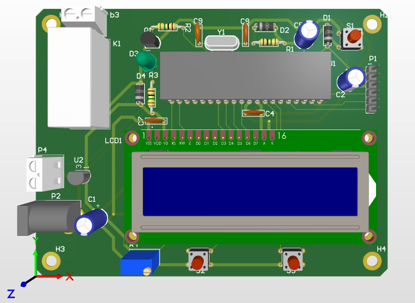

# PIC16f887-Aquecedor

Sistema Embarcado para controle de temperatura Industrial/Residencial baseado em PIC.

### Como Usar

O projeto foi Construído usando 3 Softwares diferentes: 
* MPLAB X: Para o Firmware.
* Proteus 8.9: Para a Simulação.
* Altium Designer: Para a Finalização do Hardware, lista de compras e PCB.

Para usar a parte desejada do projeto, basta, com esses softwares instalados, abrir o arquivo de projeto correspondente de cada um deles. Suas pastas e arquivos são especificados nas seções a seguir.

### Hardware

O projeto de Hardware foi feito no Altium Designer, está na pasta do [Projeto Altium](Aquecedor/), onde foi criado o [Esquemático](Aquecedor/Sheet_Aquecedor.pdf) e [PCB](Aquecedor/PCB_Aquecedor.pdf) do projeto, que consiste no Pic, um display 16x02 e botões para interação com o usuário, pinos de ICSP, circuito de reset, sensor de temperatura, saída para o sensor de água do aquecedor, circuito do oscilador e circuito driver de relé para ativação do aquecedor.

### Firmware

O firmware foi feito usando o MPLAB X, que é a pasta raiz do repositório, o código principal está no arquivo [main.c](main.c).

### Simulação

A simulação foi feita usando Proteus, todos os arquivos estão na pasta do [Projeto Proteus](Picaquecedor/) todos componentes da simulação são interativos, o que torna possível simular vários cenarios.
